# Procesverslag
Markdown is een simpele manier om HTML te schrijven.  
Markdown cheat cheet: [Hulp bij het schrijven van Markdown](https://github.com/adam-p/markdown-here/wiki/Markdown-Cheatsheet).

Nb. De standaardstructuur en de spartaanse opmaak van de README.md zijn helemaal prima. Het gaat om de inhoud van je procesverslag. Besteedt de tijd voor pracht en praal aan je website.

Nb. Door *open* toe te voegen aan een *details* element kun je deze standaard open zetten. Fijn om dat steeds voor de relevante stuk(ken) te doen.

## Jij

uitwerken voor kick-off werkgroep

### Auteur:
Joost Verweijen

#### Je startniveau:
Rood

#### Je focus:
Surface Plane & Responsiveness
 

## Je website

uitwerken voor kick-off werkgroep

### Je opdracht:
https://www.liverpoolfc.com/

#### Screenshot(s) van de eerste pagina (small screen): 
Homepage  

#### Screenshot(s) van de tweede pagina (small screen):
Fixtures Page 

 

## Breakdownschets (week 1)

uitwerken na afloop 2e werkgroep

### de hele pagina: 
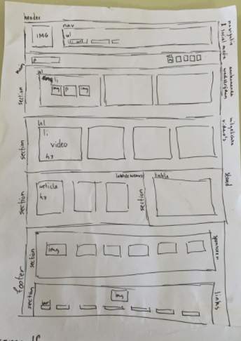

### dynamisch deel (bijv menu): 
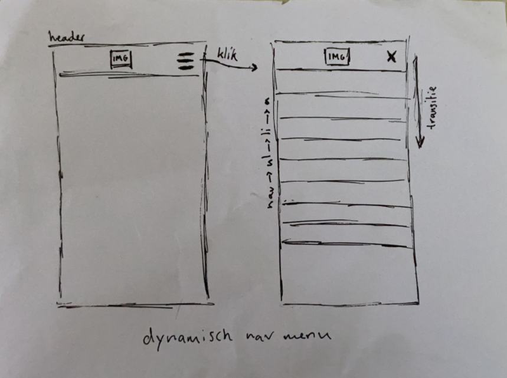

## Voortgang 1 (week 2)

uitwerken voor 1e voortgang

### Stand van zaken
Ik heb een begin gemaakt aan het schrijven van mijn code. Ten eerste heb ik de HTML helemaal op orde gemaakt op basis van mijn breakdown-schetsen. Vervolgens ben ik aan de slag gegaan met het stylen van de header. Daar ben ik op het moment van de meeting nog mee bezig. Omdat ik nog niet wist dat het handiger was om te beginnen in het mobiele formaat ben ik in desktop begonnen, wat betekend dat ik na deze meeting daarmee aan de slag moet gaan.

### Verslag van meeting
Hier na afloop snel de uitkomsten van de meeting vastleggen

- Gezamenlijk lopen we nog wat achter, ik bijvoorbeeld doordat ik op desktop ben begonnen
- Tips van de docent om weer bij te komen: naar school gaan om te werken (betere concentratie)
- Huiswerk nog eens goed bekijken en dit ook bijhouden (dit deed ik zelf al goed)
- Een goede duidelijke planning voor jezelf maken

## Voortgang 2 (week 3)

uitwerken voor 2e voortgang

### Stand van zaken
Ik ben deze week aan de slag gegaan met het omzetten van mijn desktop versie naar een mobiele versie. Hierbij heb ik ook een mooie uitklapbare navigatie gemaakt met transitions. De header en de footer zijn nu helemaal afgerond en ook responsive. Vervolgens ben ik begonnen met de main-content van mijn website, en heb ik de eerste section gemaakt.
 

### Verslag van meeting
hier na afloop snel de uitkomsten van de meeting vastleggen

- Ik persoonlijk ben goed bezig, ik moet nog wel een beetje doorwerken om de site 'ready' te krijgen voor de toegankelijkheidstest, want daarvoor moet je een volledig werkende pagina hebben
- We hebben tips gekregen over het centreren van foto's door een probleem binnen Ryan's website
- Probeer zoveel mogelijk gebruik te maken van 1 soort eenheid, dus probeer bijvoorbeeld alles in px te doen, óf alles in em te doen

## Toegankelijkheidstest (week 4)

uitwerken na test in 8e voortgang

### Bevindingen
Lijst met je bevindingen die in de test naar voren kwamen:

#### Screenreader
Blinde mensen surfen over het internet door gebruik te maken van screenreaders, het is dus belangrijk om je website hier goed op af te stellen.

Je kan je website hiervoor toegankelijk maken door duidelijke alternatieve titels voor je afbeeldingen in te stellen, focus states te gebruiken bij je links en al je elementen duidelijke benamingen te geven.
 
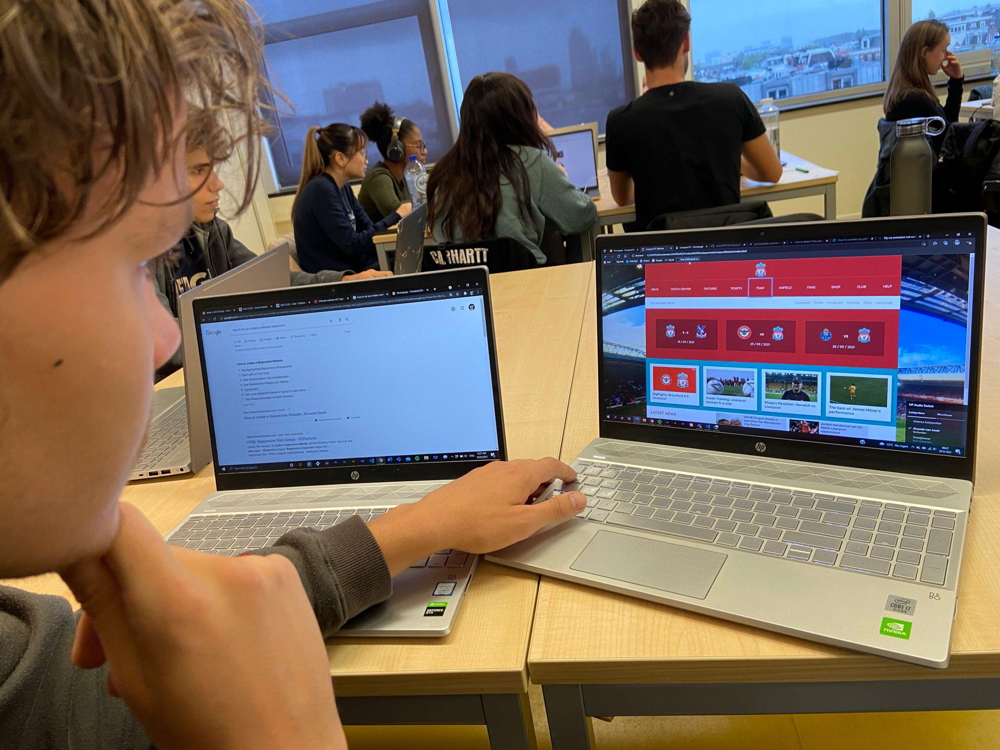

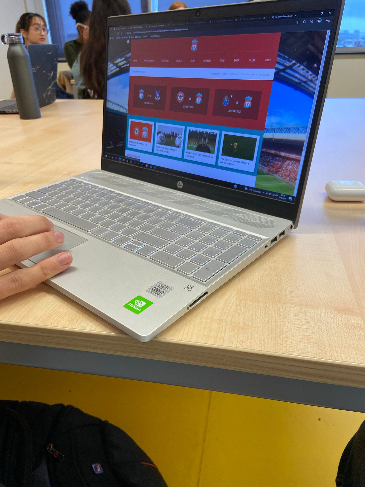

#### Slechtziend
Er zijn ook mensen die niet helemaal blind zijn, maar een beperkt zicht hebben. Deze mensen gebruiken niet altijd screenreaders maar lopen toch wel eens tegen problemen aan bij het bekijken van een website.

Vanwege deze doelgroep is het essentieel om ervoor te zorgen dat de contrasten binnen je website op orde zijn. Wanneer je bijvoorbeeld rode tekst op een zwarte achtergrond hebt is dit heel moeilijk te lezen, in vergelijking met zwart op wit, want dan weer het beste contrast is. Uiteraard is dit niet voor ieder slechtziend persoon hetzelfde en heeft ieder zijn voorkeuren qua kleuren, dus je website afstellen op iedereen zou niet haalbaar zijn.
 
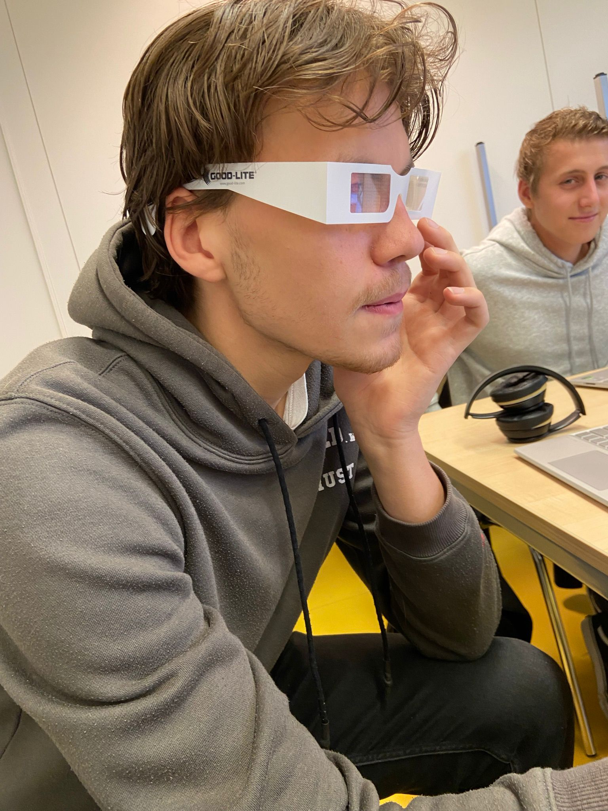

#### Motorische problemen
Wanneer men motorische problemen heeft is het erg lastig om een website te navigeren.

Voor motorische problemen is lastig een perfecte oplossing te vinden, aangezien deze mensen het altijd lastig zullen hebben. Wel kan je ze al een heel stuk helpen, door op mobiele sites bijvoorbeeld grote, makkelijk klikbare knoppen te maken. 

## Voortgang 3 (week 4)

uitwerken voor 3e voortgang

### Stand van zaken
De eerste pagina van mijn website is helemaal af, ik heb dan ook de toegankelijkheidstest kunnen uitvoeren. Mijn website werkt goed op de mobiele en de desktop versie, en is dus deels responsive. Ook heb ik een aantal hover states en animaties toegevoegd om de surface plane van mijn website te verbeteren. Het enige wat nu nog te doen is voor de aankomende week is het maken van de tweede pagina en de puntjes op de i zetten.

### Verslag van meeting
hier na afloop snel de uitkomsten van de meeting vastleggen

- Als ik voor de responsiveness wilde gaan moet ik de hele website responsive maken, dus ook de tussenformaten zoals iPad moeten er goed uit zien
- Het is leuk om te spelen met extra toevoegingen voor je site als je tijd over hebt, bijvoorbeeld leuke animaties of easter eggs
- We zijn allemaal goed bezig!

## Eindgesprek (week 5)

uitwerken voor eindgesprek

### Stand van zaken
Het is tijd om de website af te ronden! Ten eerste heb ik de tweede pagina gemaakt, en deze gelijk responsive gemaakt. Verder heb ik er ook voor gezorgd dat de website volledig responsive is, dus dat de tussenformaten er ook goed uit zien. Tot slot heb ik alle puntjes op de i gezet, zoals het netter maken van mijn css en het schrijven van deze README.

### Screenshot(s)

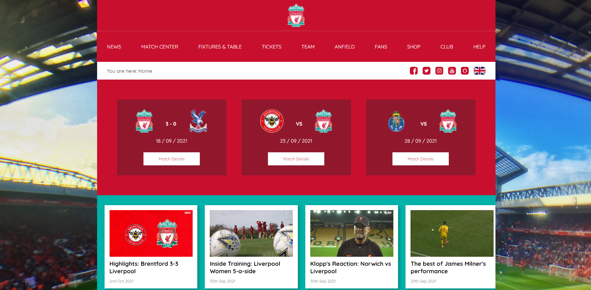
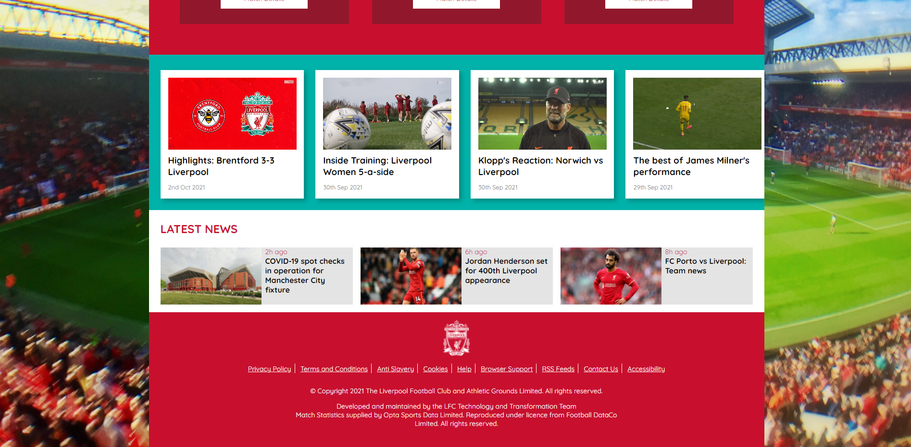
 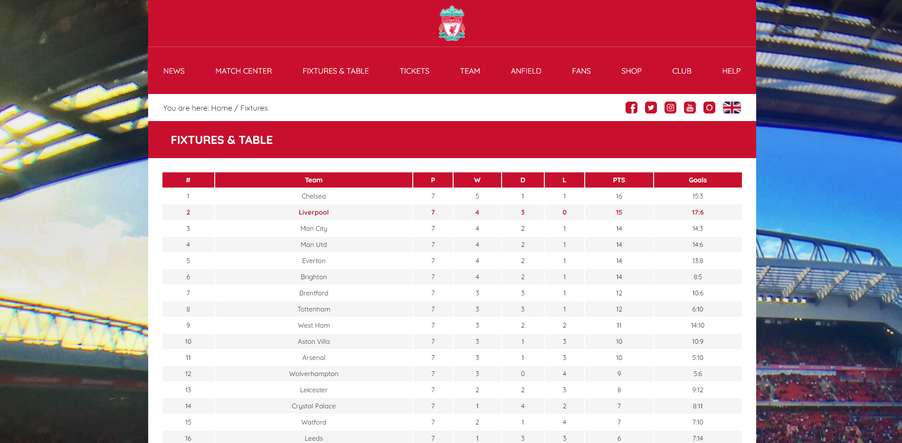
 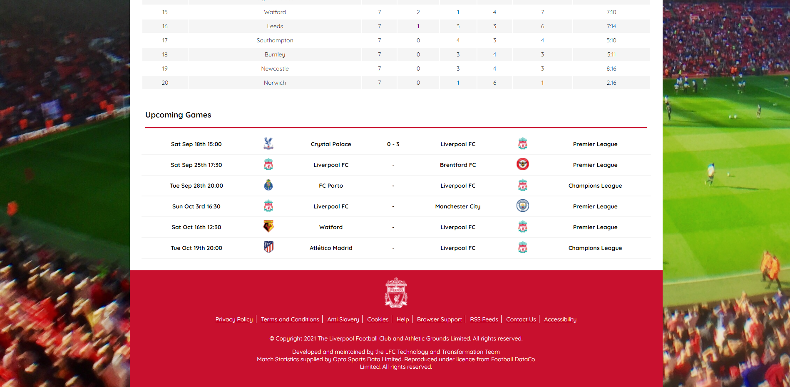
 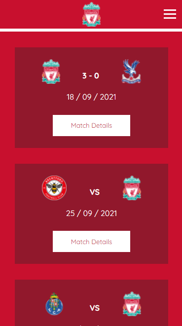
 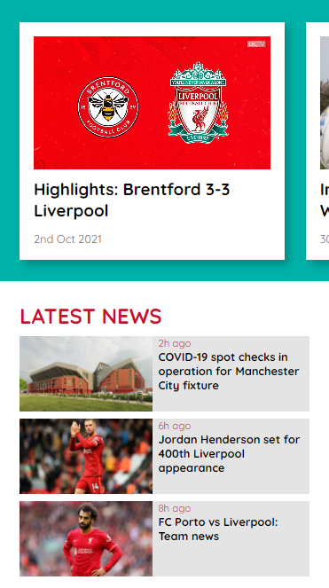
 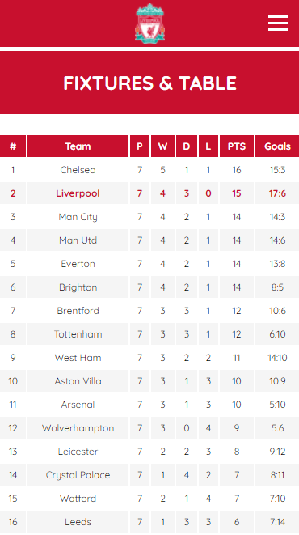
 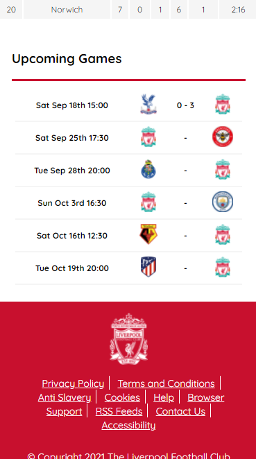

## Bronnenlijst

continu bijhouden terwijl je werkt

Nb. Wees specifiek ('css-tricks' als bron is bijv. niet specifiek genoeg).

1. Hamburger menu inspiratie/tutorial: https://dev.to/devggaurav/let-s-build-a-responsive-navbar-and-hamburger-menu-using-html-css-and-javascript-4gci
2. Grid Layout overview: https://www.w3schools.com/css/css_grid.asp
3. Flexbox guide: https://css-tricks.com/snippets/css/a-guide-to-flexbox/

